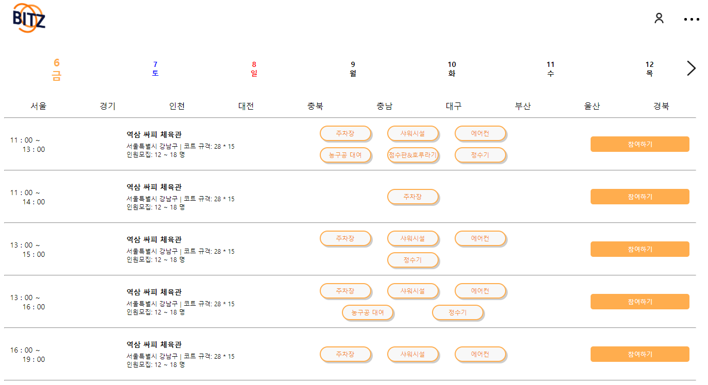

# BITZ - Basketball In The Zone
> 농구에 미쳐라! - 농구 픽업 게임 예약/매칭 애플리케이션

## 프로젝트 명세
- 개발 문서
  - S05P12A504 > OSDS_BITZ_개발문서_SUB23

- 프로젝트 배포 URL
  - http://i5a504.p.ssafy.io/

## 업데이트 내역
:white_check_mark: ver_0.1_2021.07.30
  - 개발문서 및 발표자료 배포
  - BITZ 자유시연 (로컬 ver) - 회원가입, 로그인, 비밀번호 찾기, 비밀번호 변경, 회원탈퇴

:white_check_mark: ver_0.2_2021.08.06 
  - AWS EC2를 통해 DB, Frontend, Backend 배포
  - BITZ 배포 (클라우드 서버 ver) - 경기장 등록, 픽업 게임 등록(백엔드), 일반 사용자/비즈니스 사용자 프로필 출력(백엔드)

:white_check_mark: ver_0.3_2021.08.13 **(현재 배포 버전)**
  - AWS S3 구축
  - 경기장 CRUD / 게임 CRUD
  - 일반/관리자 계정 관련 추가 기능
  - 매칭 알고리즘 

:white_large_square: ver_0.3_2021.08.20
  - 최종 버전 배포

## 개발기간
2021.07.05(월) ~ 2021.08.20(금)

## 개발 환경
- window10
- Backend 
  - Spring Boot 
- Frontend 
  - React
- DB
  - MySQL

## Developer
|권오우|박정웅|윤지영|이소은|장현웅|
| ------ | ------ | ------ | ------ | ------ |
| FrontEnd | FrontEnd | BackEnd | BackEnd | FrontEnd + BackEnd |
|  |  |  |  |  |

  

------

**Version** : 0.3

**Date** : 21.08.13 (금)

**Author** : 이소은
