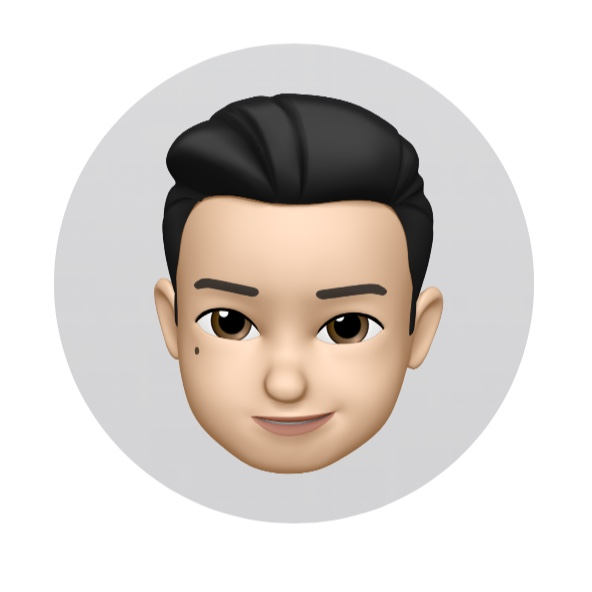

# BITZ - Basketball In The Zone

> 농구에 미쳐라! - 농구 픽업 게임 예약/매칭 애플리케이션

## 프로젝트 명세

- 개발 문서
  - S05P12A504 > OSDS_BITZ_개발문서_SUB23

- 프로젝트 배포 URL
  - http://i5a504.p.ssafy.io/

## 업데이트 내역

- :white_check_mark: 0.1 _ 2021.07.30

  - 개발문서 및 발표자료 배포
  - BITZ 자유시연 (로컬 ver) - 회원가입, 로그인, 비밀번호 찾기, 비밀번호 변경, 회원탈퇴

    

- :white_check_mark: 0.2 _ 2021.08.06 **(현재 배포 버전)**

  - AWS EC2를 통해 DB, Frontend, Backend 배포
  - 경기장 등록
  - 픽업 게임 등록

  

- :white_check_mark: 0.3 _ 2021.08.13 예정

  - CI/CD
  - Google SNS 로그인
  - 매칭 알고리즘 

## 개발기간

2021.07.05(월) ~ 2021.08.20(금)

## 개발 환경

- window10

- Backend 
  - Spring Boot 

- Frontend 
  - React

- DB
  - MySQL

## Developer

- 권오우  

  

  - FrontEnd

  

- 박정웅

  

  - FrontEnd

  

- 윤지영

  

  - BackEnd

  

- 이소은

  

  - BackEnd

  

- 장현웅

  

  - FrontEnd + BackEnd

------

**Version** : 0.2

**Date** : 21.08.06 (금)

**Author** : 이소은
